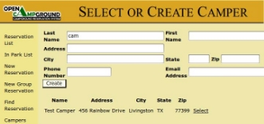

**Evaluation Only. Created with Aspose.Words. Copyright 2003-2022 Aspose Pty Ltd.**

**User's Manual**

Version1.11Update1750 *Updated: December 10, 2018*

*Forward*

*This document tries to be as accurate as possible*

*but the Open Campground system is constantly undergoing*

*changes to make it more useful to the users.*

*The result is sometimes the system will be updated more*

*quickly than the documentation.*

*Please bear with me.*

**Tableof Contents**

Introduction......................................................................................................................................................1 License.............................................................................................................................................................1 Installation........................................................................................................................................................1 Definitions.........................................................................................................................................................2 Using the system..............................................................................................................................................2

System Modes................................................................................................................................................... 2 Startup............................................................................................................................................................... 2

The Screen Layout............................................................................................................................................ 3 Reservations1.................................................................................................................................................... 3 ReservationList................................................................................................................................................................3 InParkList.......................................................................................................................................................................3 NewReservation..............................................................................................................................................................4 SelectSpace....................................................................................................................................................................4 ReviewReservation..........................................................................................................................................................4 SelectorCreateCamper..................................................................................................................................................4 Payments..........................................................................................................................................................................5 ConfirmReservation.........................................................................................................................................................5 DriveUps..........................................................................................................................................................................5 Express.............................................................................................................................................................................6 Checkin.............................................................................................................................................................................6 Checkout..........................................................................................................................................................................6 Cancel..............................................................................................................................................................................6 DisplayCamper................................................................................................................................................................6 ShowReservation............................................................................................................................................................6 ChangeDates...................................................................................................................................................................7 ChangeSpace..................................................................................................................................................................7

Site Availability................................................................................................................................................... 7 Group Reservations:.......................................................................................................................................... 7

NewGroupReservation...................................................................................................................................................8

SpaceSelection................................................................................................................................................................8

IdentifyGroup...................................................................................................................................................................8

Wagonmaster...................................................................................................................................................................8 Campers............................................................................................................................................................ 9

Reports.............................................................................................................................................................. 9 Database Backup............................................................................................................................................ 10 Administrative Functions.................................................................................................................................. 10

Maintenance...................................................................................................................................................................11 Setup..............................................................................................................................................................................12 Archives..........................................................................................................................................................................18 UserMaintenance..........................................................................................................................................................18

Translations....................................................................................................................................................18 Security..........................................................................................................................................................18

Internet............................................................................................................................................................ 18

Cookies............................................................................................................................................................ 19

Javascript........................................................................................................................................................ 19 Run through:..................................................................................................................................................19 Appendix A: Installing Open Campground forWindows™ download............................................................21 Appendix B: Installing Open Campground forWindows™ on a CD..............................................................22 Appendix C: Installing Open Campground in the Cloud................................................................................24 Appendix D: Installing Open Campground source download........................................................................24 Appendix E: Remote Reservation System Setup..........................................................................................25 Appendix F: Payment Setup..........................................................................................................................27

Paypal setup.................................................................................................................................................... 27

CardConnect setup.......................................................................................................................................... 27 Appendix G: Email Configuration...................................................................................................................28

**Created with an evaluation copy of Aspose.Words. To discover the full versions of our APIs please visit: https://products.aspose.com/words/**

Appendix H: Using multiple computers..........................................................................................................29 Appendix I: Display Customization................................................................................................................30

Displayof logo image...................................................................................................................................... 30

**Created with an evaluation copy of Aspose.Words. To discover the full versions of our APIs please visit: https://products.aspose.com/words/**
Version 1.11 Users Manual

Information on new versions of the system and availability of **Introduction** updates as well as tips and techniques for using the system are also 

found there.  Information on the system can also be found on 

facebook at *https://facebook.com/opencampground*. If you use the *Open Campground* is a computer based campground reservation  Subversion version control system you can checkout the source from 

system aimed at smaller campgrounds who do not want or can not  *svn://ocsrv.net/trunk*.

afford one of the more expensive competing systems.  It has a 

database spaces in management the campground system and at campersits core .  and It is primarily able to run keeps on almost track of  The *Rails*system   (and *Instant* is built  *Rails*on the  for foundation Windows of systems) *MySQL*which , *Ruby*are  and all *Ruby* also  *on* any computer system running Windows or Linux.  It should run on  open source applications and are available to anyone to use.  It is 

any system which supports Ruby on Rails such as MacOS but it has  designed to be easily maintainable and usable.  This results in a 

not yet been tested on all of those systems.  It is built as a web  system that is relatively simple to modify (as computer based 

browser interfaced application and will run using any modern  systems go)  if one wants different features. Things like new 

browser such as Internet Explorer, Chrome or Firefox etc.  It will  functions and new displays are fairly complicated but still are doable work with any printer your system supports.   by persons familiar with web and database programming.  The skills 

needed in someone setting up the system on Windows with 

Based as it is on a web paradigm, the system is multi-user.  One  InstantRails are basic familiarity with the use of a Windows 

computer is the system server on which the database resides and  computer system and the ability to follow instructions.  For 

users will use the screen, keyboard and mouse on that and other  modifying the system you will need SQL familiarity, ability to computers.  The usual initial system is one computer with screen,  modify web pages (if desired), possibility some knowledge of the keyboard and mouse which is the system server and the user  Ruby language, a knowledge of how RV Parks/Campgrounds 

interface system.  This type of a configuration does not require any  function and the ability to follow instructions.  I developed this connection to the Internet to operate. This system can also be used  system because I was a full time RVer and I wanted to find something

for other purposes at the same time.  If wanted, additional systems  useful I could do with my many years of experience as a software 

for computer W8 which application **connect** and indowsmore 10 hosts **the** as concurrent  configuror but well *Open* **system** Linuxthere as ation *Campgr*. a  users The **to** is number **the** a that system **security** can  *ound***Internet** will of be  Linux does has support add**risk without** beed not distributionsen **to** with a have **the** tested current very **having database** to with bminimal e version . dedicated   **a** WThe **fir**indows **if ewall you** systof effort.em to XPthat   At , 7, developerI identification [Norm@](mailto:Norm@OpenCampground.com)[http://facebook.](http://facebook.com/opencampground)**L**am **ic**open **e[OpenCampground.](mailto:Norm@OpenCampground.com)n**. to   **s** any of **e[ com/opencampground](http://facebook.com/opencampground)**problemsand all suggestions .  [com](mailto:Norm@OpenCampground.com)Send  or email go for to [.](http://facebook.com/opencampground) to the improvements me Facebook (Norm Scherer) page and at at 

its maximum the system could use a dedicated computer as the server

with networked computers for users.    The system will run on any 

**operational**.  **If the system is connected to the Internet it must** 

**have a firewall (hardware or software) and you must make sure**  The license for this system is the GNU Public License which permits 

**you use logins so you have password protection**.  If using  copying the system, modifying it and using it for most any purpose.  Windows, the Windows  firewall will probably be adequate but it  Endnote *i* is a copy of the license.  It is also available under admin-

must be enabled.  Use only one software firewall.  If you install a  >license on a running system.

firewall from another vendor follow the software vendors 

instructions.

The simplest way to use Open Campground is an installation in the  **Installation**

Cloud where Open Campground is hosted on a server which you will

not have to manage or maintain.  You will need to have a system (or  To install the system I recommend you first print this document and as  many systems as you  want) in your office which can access the  familiarize yourself with the instructions.  Then follow the 

Internet and all backups, updates and system management will be  instructions in the appropriate appendix as closely as possible.  The handled for you.  The system with which you connect can be a  system is available in four different forms described in the following desktop computer, a laptop or a tablet or smart phone.  Your  appendices.

reservation system will be usable to you anywhere you have access 

to the Internet and a device which can connect.  Go to the  • A – Open Campground for Windows™ Download [Opencampground.com/products ](http://opencampground.com/products.html)web page for more information on  • B – Open Campground for Windows™ CD

that option.

*Open Campground* is an open source application.  This means the  • C – Open Campground in the Cloud

source of it is available to anyone to use or modify.  It is licensed  • D – Open Campground Source Download

under the GPL version 2i.  Anyone who wants to download the 

system and use it for their campground is welcome to do so.  The  You will use only one of these alternatives but it is quite easy to system can be downloaded from the Downloads page at  transition from one to the other.

[http://opencampground.com.](http://opencampground.com/)  Both a system with supporting 

software for Windows and the source version are available there. 

**Definitions SystemModes**

Thesystemisdesignedtofunctionineitheroftwomodes. Ifyouare FromknowingStartfacilitiesconsideredanotherEnd datedatetimeguestofthe::tooccupiedThistheThisdefinitions.timecampgroundisisquestionsthetheondatedatetheofsomeastart.ahaveguestForguestdatetermspurposescomedepartsarrivesandusedupitandthatandofwillinreservationsthisnobeginscannotlongersystembebehandledusingallocateduses.thethethesitebytois youwithoutmodesystemcanhasanddisturbingbringafamiliarizere­loadableupthedatasystemyourselfdatabaseinyourin*training*productionwiththathowcanmodebeitsystem.worksusedfortotraining. Theexplore*trainingpr*etc*oduction*the.

exploringthesystemtoseehowitworksorfortrainingyouwilluse

the*training*mode. Ifyouareusingthesystemtoactuallymanagea campground you will use the*production*mode. The*training*mode usesaseparatedatabasefromthe*production*modesoatanytime

The

facilities. Forpurposesofreservationsthesiteisconsideredvacant

reservation. modecampgroundhas*training*anemptywithmodeyourdatabasetoowncreatepreferences.readyreservations,foryouItorecommendcheckdefinecampersyourthatowninyouandfirst ontheenddateandwillbeavailableforallocationtoanother

usethe

Weeklyreservation: Areservationwillbechargedtheweeklyrate out, andexplorethevariousfunctionsofthesystem beforesetting (ifdefined)ifthereservationstartdateandenddateareonthesame upthesysteminthe*production*mode. Differentversionsofthe

dayoftheweek. Ifthereservationisformorethanamultipleofa systemwillchangemodesindifferentwaysasdescribedinthe weektheremainderafterthelastfullweekwillbechargedatthe appendicesreferredtointheInstallation sectionearlier.

dailyrate. Thedailyrateisusedifaweeklyratehasnotbeen

defined.

**Startup** Monthlyreservation:Areservationwillbechargedthemonthly

rate(ifdefined)ifthereservationstartdateandenddateareonthe Each time you restart your computer you will have to start the servers samedayofthemonth. Thedefinedmonthlyratewillbecharged unless you have set the system up to start automatically.  To start the regardlessofthenumberofdaysinthemonth. Ifthereservationis system, perform steps given in the Installation appendices referred to formorethanamultipleofamonththeremainderafterthelastfull earlier.   This does not apply to Open Campground in the Cloud.  In monthwillbechargedattheweeklyordailyrateasapplicable. This all cases you will have to connect to the servers with your browser as willmeanthatthesamemonthlyratewillbeappliedtoastayof28 described above.

daysinFebruaryasisappliedtoastayof31daysinMarch. The following sections describe how to use the various parts of the 

system.  The *setup* area (accessed from the *admin* entry on the 

navigation area) must be completed before the system can be used.  **Using the system** In the *training* mode a database initialization function is provided in 

*setup* which will automatically populate the database with data Youwillaccessthesystemusingyournormalbrowser(Internet intended for the current day.  The other areas should be read but you Explorer, ChromeorFirefoxforexample). YouentertheURL can also explore them just by trying them out.

[http://localhost:3000 ](http://localhost:3000/)(forlocallyinstalledversions)intheaddress Upon startup when no sites have been defined, you will be taken to areaofyourbrowserandyouwillhaveaccesstothedisplays. Note: the *Setup* display.  At any other time, on startup the system will 

On some Windows and browser versions you may have to use display the *Reservation List*.  This is the central display of the [http://127.0.0.1:3000.](http://127.0.0.1:3000/) If you installed Open Campground from the system.  In all cases if *User Login* has been enabled a *Login* display CDyouwillfindashortcutonthedesktopnamedOpen will be presented before any other displays (unless you have selected Campground. Selecting this will bring up your default browser *remember me* in options).  The reservation process is covered in the connected to the currently running Open Campground version. If following *Campers*section  and of this *Admin*manual functions . From which the navigation will be disarea cussed we can 

access 

youareusingOpenCampgroundintheCloud, separateURLsfor separately later. trainingandproductionmodeswillbesuppliedtoyouandyouwill

accessthesystemthroughtheseURLs. OpenCampgroundinthe At any time you can do any other function on the computer or access CloudworksthroughtheInternet, forotherconfigurationsyouwill any other web page in the normal fashion and come back to the Open notneedtobeconnectedtotheInternetexcepttoaccessupdates. In Campground pages when you wish.  You will encounter errors if you 

interrupt the process of creating a reservation and then later try to allservercasesisyouonandwillenablehavetojavascriptenablecookies(this isfromthe normalthe systemsituation).the return capability to the of samthe browser e reservation(supported .  I find by it convenicurrent ent versions to use of the Internet tab 

Connectingwithyourbrowserwillbringuptheinitialdisplaysfor Explorer, Chrome, Firefox and others) to keep the Open Campground OpenCampground. Youcansimplifylateruseofthesystemby display up in one tab and do other things in other tabs. creatingabookmarkorfavoritefortheURL.

**TheScreenLayout** individually.  Page through the list using the links at the bottom.

The first column gives the reservation number which was assigned 

At all times except for initial login the screen will be presented in a  when the reservation was created.  The date format used for the start common format.  At the top will be an area containing a word or two  date and end date of the reservation will be that usually used in your describing the current function.  At the left end of this area will be  locale.  Rig type, slides and length are all as entered when the 

the Open Campground logo or a logo you specify in the setup  reservation was created or modified.  These fields are only for process.  In the top right of this area will be the word 'training' if the  information and their use and display is optional (see *setup*).  If you system is in training mode instead of production mode.  At the lower  have defined the length field for a space and the length entered in the right will be a pull-down menu that you can use to select the  reservation is greater than that value a warning message will be language and locale the system operational displays use. printed at the top of the next display.  If the length field for the space If you select the option to navigate by tabs, under the top area will be is 0 the value entered in the reservation is not checked.  The *space* is an array of buttons that you will use to navigate through the system. the name of the assigned space as defined in system setup described 

later.  The order in which the spaces are displayed is defined in the 

If you do not select that option, a navigation area will be presented  space setup display.

on the left side of the screen giving links to use for navigation. *checkin*, the background of that reservation

If a camper is overdue for 

Under the tabs or the top banner will be displayed informational,  entry will be yellow (any of these colors can be changed in *setup*).  If warning and error messages.  The messages will be presented in a  the camper is due to check in today the background will be a pinkish box which will be green for information, yellow for warning and red  shade.  

for error messages. If you use *Remote Reservations*, any remote reservation will initially 

appear in the system on the *Reservation List* in blue at the top of the 

list.  The options on the right of the entry will be *Review* and *Cancel*. **Reservations [1**](#_page6_x58.50_y673.50)** If you select *Review* it will take you to the *Review* display where you 

can *Confirm* or *Cancel* the reservation.  This is to give you the ability

to control the reservations in your campground.  After a reservation is **Reservation List** confirmed it will be the same as any other reservation in the system.

The *Reservation List* is the heart of Open Campground.  The starting 

display is this list of current reservations.  The buttons at the column  **In Park List**

heads will set the sort order.  Click on any of the buttons to change 

how the list is sorted. The *In Park* list is generally similar to the *Reservation list* except that

it displays a list of the campers who are presently checked in to the campground.  As with the reservation list the buttons at the top will change the sort order.   On the In Park list there are links on each entry for *show* and *checkout*.

On in display your this browserwith list the the camper'. full  If you information s selename ct the is aon  camper'link the and camper s will name (see be you identified *Display* will be as given such a  As further If background a in camper the information Reservis of in that ation the ron eservation park Listthat past , the camperthe campers display reservation . will nambe e end is a a grdatelink ay shade,to  the a display .  If the of *Camper*).  If you select a group name the information on the group  camper is due to check out today the background will be a yellow 

will be displayed.  Other links give you the capability to *show* or  shade.  

*cancel* the reservation or to *checkin* the guest.  *Show* will display the  If it is possible to extend any of these reservations by one day, an 

details of the reservation and enable you to edit the reservation.  For  *extend* link will appear at the end of the line.  Selecting that link will 

a group, the links will be *expand*, *checkin* and *cancel*.  *Checkin* and  extend the reservation by one day each time the link is selected.  

*cancel* will perform the designated operation on all reservations  Likewise if the reservation can be extended by a month a link will be associated with that group.  *Expand* will show each reservation in the presented for that.

group and will enable you to *show*, *checkin* or *cancel* them 

Notice that on this list as illustrated we have the *Payments in Lists *

\1. In all sections of this document a stay in the campground will be referred to as a  option (described later) enabled.

*reservation* whether the stay is in the future, past or the present. 

**New Reservation** the start date of the reservation.  The actual charges will be computed

by checking each day in the reservation period to determine which 

A new reservation is initiated by selecting *New Reservation* from the  rate and season applies to it.  The rate will be computed based on the sidebar.  This will bring up a new reservation display.  varying seasons.   If the reservation starts on the current date, any 

space that has been identified as *unavailable* (in *admin->reports- >space summary*) will not be shown.  If the reservation starts any 

other date a space shown as *unavailable* will be listed.  If a space 

does not have rates assigned to be displayed, that space will not be displayed.  This could happen for example if you have assigned full season rates to some spaces but not all and you are processing a full season reservation.  Only the spaces having a full season rate would 

be shown.

Selecting the *select* item for the desired site will cause the display to advance to a summary *Review Reservation* screen.

**Review Reservation**

This screen is the same as other reservation display screens (picture 

On this display you will select the start and end date of the  and discussion in *Confirm Reservation*) without camper information. reservation and identify the type of site desired (values from the  With this screen you can discuss with the potential guest the site and 

*sitetype* table will be presented to select from) and the *discount* (if  projected cost etc.   Any item in the top half of the page that is in a 

any) to be used in rate calculations.  If the *Full Season Rates* option  box can be edited by selecting it with a single click.  The drop-downs was selected in the setup process, a check-box to select the full  for *Rigtype* or *Discount* can be used in the usual manner.  Some 

season will be presented.  If this is selected the dates set up for  browsers do not display empty fields correctly so on those browsers season start and end will be displayed and no other dates may be  there will be an *edit* button for any empty fields.  Just select the 

used. As shown here the the dates are selected on a calendar  button with a single click to edit those fields.

representation for the start and end dates. When the display comes 

next *date*process. daywill  .  Selebe  Wset hen cting to you a the day select *Find* later a  *Space*difthan ferent  the button *start* date will for *date*advance th. e   If *start* you to  *date*have a display , the defin*end* edof Any information dates **not selection** the button process **use** changes or in **the** space the **display**can **back** summary navigation that need be .**page** will   cancIf changing the in afeled **function** fect areathe guest by .lower th there  If e wants selecting charyou **to** right are **try** ges select to buttons **to** prohand will the **go** *Cancel* ceed,*Cancel* be **back** side.to reflected  select chang   *Reservation***to**   *Res*Note **the** e *continueervation*thosein that **space** the if .  rthe   the  **Do** ate or up, the *start date* will be the current date and the *end date* will be 

any *extras* you can select them at this time. You will have the 

opportunity to change any of these values at a later stage in the 

the sites of the identified type which are not already reserved for the 

selected dates.   Notice that this picture shows the *Silver* color  space you just will abandon be immediately the process returned by going to thto e another pool of task,available  the sitsites.e will   If selection from the colors setup described later.

not be available for 30 minutes.  This delay is to allow for the 

possibility that you are still discussing the stay with the prospective **SelectSpace** guest.

The list will have the properties of the sites (as set up in the *spaces*  **Selector Create Camper** table) and the rates applicable to each site using the *season* current at 

Selecting the *continue* button from above will continue the reservation process and bring up a display with a camper details entry section at the top.  When you enter the camper's last name in this section, campers already in the system whose names match what you have entered will be displayed and may be selected if appropriate.  For example if the camper with whom you are working is named Test Camper you would start by entering 'C' in the last name space. 

A completion notice will be posted and the reservation will be updated with the results.

**Confirm Reservation**

Selecting *complete reservation* (or *checkin now* if the start date is the current date or earlier) will complete the reservation process.  You 

could alternatively  select *cancel reservation* from the navigation 

`  `As soon as you enter the 'C' a list of all campers in the database  whose names start with 'C'  like Crane, Carson and Camper will be  displayed.  As you continue and enter an 'a'  only names that start  with 'Ca' like Carson and Camper will be displayed.  If this is a  returning camper you can select the correct camper from the list  whenever you want to.  The more characters you enter the more  selective the list of campers will be.   

If you selected the *Auto filter on Firstname* or *Auto filter on City* options the same functions will work to select from the list by 

completing the First name and/or City.

If the camper is not in the list you can just proceed with entering the  

details for this camper.  You must enter at least a *last name*.  All other 

entries are optional except as specified in *Manditory Camper Entries* in *setup->system options*.  The name will be stored as entered.  No 

capitalization will be added.

If you have selected the *Use ID Number* and *Find by ID Number* 

options in *setup*, a dialog for entry of ID Number will be shown.  The

ID Number entry will accommodate both numbers and letters as 

desired.

area and the reservation will be deleted and the reservation database After you select an existing camper or select the *Create* button for a  will be as it was before the process started.  The camper, if you 

new camper,  the *Confirm Reservation* display will be brought up for  created a new camper,  will remain in the database.  On this page you entry of payment information (like a credit card for deposit) if  will again be able to edit any items desired including dates and space desired. and you can also print the reservation information (using the print 

*Desert* colors. button if configured or your browser print function), complete the Notice that this display shows the  reservation or cancel the reservation.   The printed reservation will 

not show the display artifacts and will be usable as a reciept if **Payments** desired.  The *header* and *trailer* defined in *setup* will appear on the 

printed version.

If you have selected CardConnect payments in the office the 

handling of the *Payment Type* field will be expanded.  It will not only On this example a *check in now* button will be shown if the start date 

of the reservation is the current date.  It is not shown if the 

be for recording a payment but it will cause the processing of the 

reservation starts in the future.

credit card. The display will be like this:

If you do not have a card terminal the two Terminal entries will not  **Drive Ups**

be prompt shownyou .  If to you insert/swipe select *Terminal*the card. *Pr*  *ocess*  If you  *Car*select  *d* the *Terminal*card terminal  *Manual* will When a camper arrives with no reservation you will go through the *Card* the terminal will prompt you to enter the card number.  In both *New* use the *ReserCheck vationin*   *Now*process button . On to the check *confirm*  the  *r*camper *eservation*in immediat page you elycan .   If cases it will first put up a small display where you can change the  you make a reservation after the fact (next morning for a late arrival 

amount to be charged.  If you select the *Tokenizer Process Card* a 

dialog for editing the amount and then entering the card number and  for current example) date but you you will will be also warned be presented that the start with date the is *Check* earlier  *in* than  *Now*th  e expiration date will be presented.  The part handling the card number  button and the process can continue.  

is really an iframe that will pass the number directly to the card 

processor without it ever being processed on the server.

**Express** stay and camper is copied to an archive database table.  The end date 

for the stay will be the date displayed in the list.  If it is not the 

An option is also available for  the quick creation of reservations.   current date (a late or early recording of a checkout) a confirm dialog This is enabled in *System Options* as described later. will be presented.  The camper data is retained in the camper 

database table for use when the camper makes a new reservation. 

As shown here you will have to specify the start and end dates and 

you can then select a space from the pull-down.  The count of spaces 

of *Complete* the type  *Res*spe *ervation*cified which  and will are avbe ailable taken to is the shown.*Review*  You  page then as select  **Cancel**

described above.  You will then go to pages as in the normal  From the *reservation list*  you can also select *cancel* for a specific reservation flow.  This is designed primarily for campgrounds where  reservation.  This will bring up a small confirmation dialog and then the guest may go out and select a space and you will catch up with  a summary of the reservation being canceled.  On this page the 

the process after the fact. reason for the cancellation can be entered.  This reason as well as the date and time of the cancellation will be recorded in the archive table

along with all of the other details of the reservation.  If user logins are in use, the username of the person doing the cancellation will be recorded.  The reservation will be deleted when *complete cancellation* is selected.  If a camper has already checked in you cannot *cancel* the reservation,  instead you will use the checkout function to remove them from the list of current reservations.

**Display Camper**

The camper name in the *Reservation List* and *In Park List* is a link to 

the camper display.  If you want to see or change details on the **Checkin** *camper* (such as spelling of name, address, phone number or email 

**This document was truncated here because it was created in the Evaluation Mode.**
**Created with an evaluation copy of Aspose.Words. To discover the full versions of our APIs please visit: https://products.aspose.com/words/**

9
